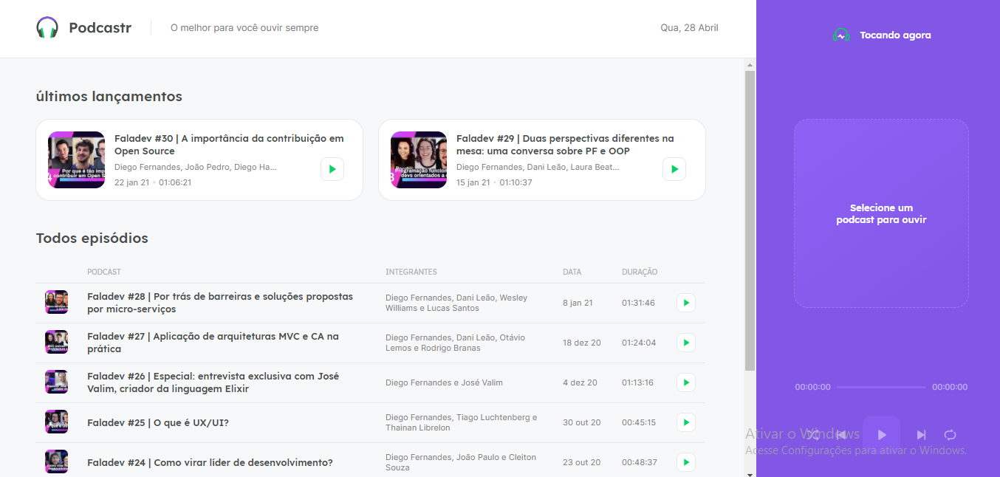
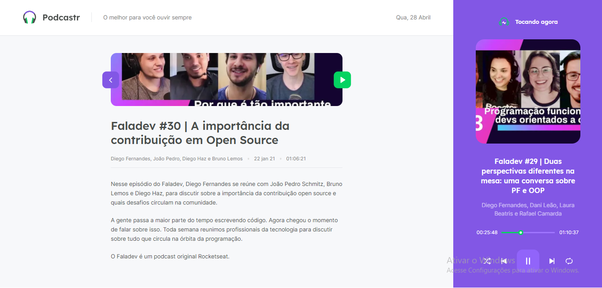

<h1 align="center">
    Podcastr
</h1>

<h4 align="center">
  Interface do Podcastr 🎧
</h4>

 

Tela inicial do Site

  

 

Tela de player do site

  

 

## :rocket: Tecnologias

Esse projeto foi desenvolvido com as seguintes tecnologias:

- [React](https://reactjs.org)
- [Typescript](https://www.typescriptlang.org/)
- [Sass](https://sass-lang.com/)
- [Next](https://nextjs.org/)

## 💻 Projeto

O projeto consiste em uma plataforma para reproduzir podcasts com um player capaz de mover por varias telas sem perder a continuação do projeto.

## 🤔 Como contribuir

- Faça um fork desse repositório;
- Cria uma branch com a sua feature: `git checkout -b minha-feature`;
- Faça commit das suas alterações: `git commit -m 'feat: Minha nova feature'`;
- Faça push para a sua branch: `git push origin minha-feature`.